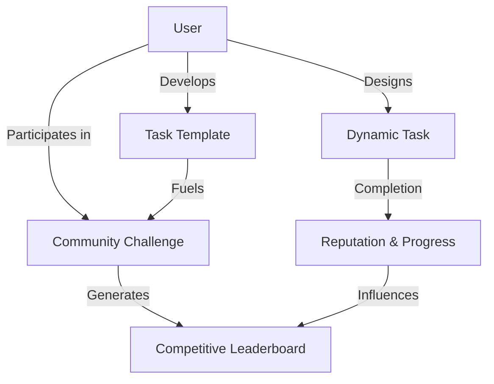

# Innovative Impermanent Utility

A groundbreaking blockchain-powered platform for dynamic task management, personal growth tracking, and community-driven motivation.

## Overview

Innovative Impermanent Utility transforms how individuals approach personal development by creating a decentralized ecosystem of tasks, challenges, and rewards. Built on the Stacks blockchain, this platform enables users to design, track, and monetize their personal and professional growth journeys.

### Key Innovations

- **Dynamic Task Creation**: Craft personalized tasks with flexible parameters
- **Reputation-Based Economy**: Earn and spend reputation across challenges
- **Transparent Tracking**: Blockchain-verified progress and achievements
- **Community Challenges**: Collaborative growth environments
- **Tradable Task Templates**: Create, share, and monetize task blueprints

## Core Architectural Principles



### System Components

1. **Dynamic Tasks**: Adaptable personal development units
2. **User Profiles**: Comprehensive progress and reputation tracking
3. **Task Templates**: Shareable, monetizable task frameworks
4. **Community Challenges**: Collaborative growth initiatives
5. **Reputation Marketplace**: Incentive and engagement mechanism

## Getting Started

### Prerequisites

- Clarinet
- Stacks Wallet
- Basic understanding of blockchain interactions

### Quick Setup

1. Clone the repository
2. Install dependencies: `clarinet install`
3. Deploy to local or test network

### Basic Interactions

1. Create a task:
```clarity
(contract-call? .impermanent-utility create-task 
  "Daily Learning" 
  "Commit to 30 minutes of focused learning" 
  u1 none u2 u15 none)
```

2. Complete a task:
```clarity
(contract-call? .impermanent-utility complete-task u1)
```

3. Join a community challenge:
```clarity
(contract-call? .impermanent-utility join-challenge u1)
```

## Development & Contribution

### Testing

Run comprehensive test suite:
```bash
clarinet test
```

### Local Development

1. Start Clarinet console:
```bash
clarinet console
```

## Security & Transparency

### Design Considerations

- Self-reported task completion
- Participant-driven verification
- Reputation as a dynamic incentive mechanism

### Best Practices

- Verify transaction outcomes
- Monitor reputation dynamics
- Optimize blockchain interaction costs
- Maintain secure key management

## License

[Insert Appropriate Open Source License]

## Community

Connect, contribute, and grow together! 

- Discord: [Community Link]
- Twitter: [Project Handle]
- GitHub Discussions

Empowering personal growth, one block at a time. 🚀🔗